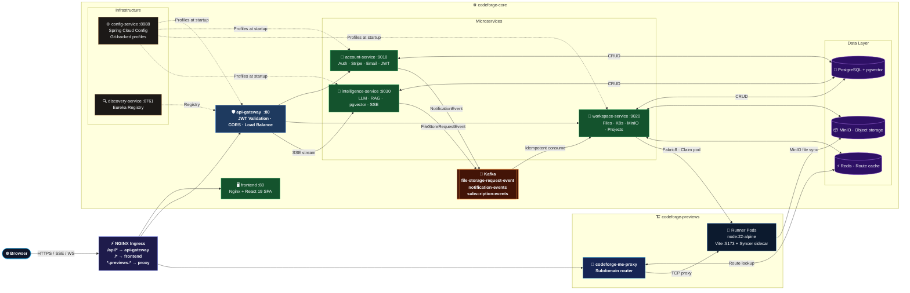

<div align="center">


<br/>

[](https://openjdk.org/projects/jdk/21/)
[](https://spring.io/projects/spring-boot)
[](https://spring.io/projects/spring-ai)
[](https://kubernetes.io/)
[](https://cloud.google.com/kubernetes-engine)
[](https://kafka.apache.org/)

<br/>

[](https://opensource.org/licenses/MIT)
[]()
[](https://github.com/aditighoshagd/Distributed-CodeForge/actions)
[]()

<br/>

> **A cloud-native, AI-powered collaborative IDE with instant Kubernetes sandbox previews.**
> Build, preview, and ship — all from your browser.

**🌐 Live:** [codeforge.arclite.site](https://codeforge.arclite.site)

<br/>

[🎨 Architecture](#-system-architecture) &nbsp;•&nbsp; [🔌 API Reference](#-api-reference) &nbsp;•&nbsp; [📁 Repository Map](#-repository-map) &nbsp;•&nbsp; [⚡ Key Flows](#-key-execution-flows) &nbsp;•&nbsp; [🚀 Quick Start](#-quick-start) &nbsp;•&nbsp; [🔄 CI/CD](#-cicd-pipeline) &nbsp;•&nbsp; [🖥️ Frontend](#️-frontend-repository)

</div>

---

## 📖 What Is This?

**Distributed CodeForge** is a cloud-native, full-stack collaborative IDE where users write code and an AI agent (backed by LLMs via OpenRouter) reads the project, generates code, edits files, and live-previews in an isolated Kubernetes runner pod — all in the browser.

The backend is a **Java 21 / Spring Boot 3** microservices system with:
- **5 independent services** with their own databases and CI/CD pipelines
- **Reactive SSE streaming** of LLM output via Spring AI + Project Reactor
- **pgvector RAG** — file chunks stored as vector embeddings and retrieved at chat time
- **Kafka Saga** — LLM-emitted `FILE_EDIT` events published as `FileStoreRequestEvent` and idempotently consumed by workspace-service
- **Fabric8 Kubernetes client** dynamically managing sandbox runner pods inside GKE
- **Conversational summarization** — older messages outside a 10-turn rolling window are incrementally summarized to preserve context without blowing the LLM context limit

---

## 🎨 System Architecture

Two Kubernetes namespaces, network-isolated from each other:
- `codeforge-core` — control plane: microservices, databases, Kafka, MinIO
- `codeforge-previews` — sandbox execution plane: isolated runner pods



---

## 🔌 API Reference

### 👤 Account Service `:9010`

<details>
<summary><b>Auth Endpoints  <code>POST /auth/*</code></b></summary>

| Method | Path | Description |
|:---:|:---|:---|
| `POST` | `/auth/signup` | Register new user → returns JWT + user profile |
| `POST` | `/auth/login` | Authenticate → returns JWT + user profile |
| `POST` | `/auth/forgot-password` | Send password reset email via Brevo SMTP |
| `POST` | `/auth/reset-password` | Apply reset token → update password |

**Signup / Login Response:**
```json
{
  "token": "eyJhbGciOiJIUzI1NiIsInR5cCI6IkpXVCJ9...",
  "user": {
    "id": 1,
    "name": "Aditi Ghosh",
    "username": "aditi@example.com"
  }
}
```

</details>

<details>
<summary><b>Billing Endpoints  <code>/payments/*  /webhooks/*</code></b></summary>

| Method | Path | Description |
|:---:|:---|:---|
| `GET` | `/me/subscription` | Get current user's subscription plan & token quota |
| `POST` | `/payments/checkout` | Create Stripe Checkout Session → returns redirect URL |
| `POST` | `/payments/portal` | Open Stripe Customer Portal → manage billing |
| `POST` | `/webhooks/payment` | Stripe webhook handler (verifies `Stripe-Signature` header, idempotent) |

</details>

<details>
<summary><b>Internal Endpoints  <code>/internal/v1/*</code></b></summary>

> Called service-to-service (not exposed to internet)

| Method | Path | Description |
|:---:|:---|:---|
| `GET` | `/internal/v1/users/{id}` | Fetch `UserDto` by ID (called by workspace-service) |
| `GET` | `/internal/v1/users/by-email` | Fetch `UserDto` by email |
| `GET` | `/internal/v1/billing/current-plan` | Return `PlanDto` with token quota (called by intelligence-service) |

</details>

---

### 📁 Workspace Service `:9020`

<details>
<summary><b>Projects  <code>/projects/*</code></b></summary>

| Method | Path | Description |
|:---:|:---|:---|
| `GET` | `/projects` | List all projects for current user |
| `GET` | `/projects/{id}` | Get project by ID |
| `POST` | `/projects` | Create project (from template or blank) |
| `PATCH` | `/projects/{id}` | Rename / update project |
| `DELETE` | `/projects/{id}` | Soft delete project |
| `POST` | `/projects/{id}/deploy` | **Claim runner pod**, install deps, start Vite dev server |
| `GET` | `/projects/{id}/logs` | Stream stdout from runner pod |

**Deploy Flow (inside `KubernetesDeploymentServiceImpl`):**
1. Check if a pod is already `BUSY` for this `project-id`
2. If found + Vite already running → skip reinstall (fast path)
3. If found + Vite not running → `npm install && fuser -k 5173/tcp && nohup npm run dev`
4. If not found → claim an idle pod from the pool (`status=idle` → `status=busy`), write Redis route key, start Vite

</details>

<details>
<summary><b>Files  <code>/projects/{id}/files/*</code></b></summary>

| Method | Path | Description |
|:---:|:---|:---|
| `GET` | `/projects/{id}/files` | Get full project file tree (from MinIO) |
| `GET` | `/projects/{id}/files/content?path=` | Read file contents |
| `GET` | `/projects/{id}/files/attachments/{fileName}` | Fetch chat image attachment |

</details>

<details>
<summary><b>Members  <code>/projects/{id}/members/*</code></b></summary>

| Method | Path | Description |
|:---:|:---|:---|
| `GET` | `/projects/{id}/members` | List members with roles |
| `POST` | `/projects/{id}/members` | Invite member by email |
| `PATCH` | `/projects/{id}/members/{memberId}` | Update member role |
| `DELETE` | `/projects/{id}/members/{memberId}` | Remove member |

</details>

<details>
<summary><b>Internal Endpoints  <code>/internal/v1/*</code></b></summary>

> Called service-to-service — used by intelligence-service for RAG context

| Method | Path | Description |
|:---:|:---|:---|
| `GET` | `/internal/v1/projects/{id}/files/tree` | File tree (for LLM context injection) |
| `GET` | `/internal/v1/projects/{id}/files/content?path=` | File content (for RAG) |
| `GET` | `/internal/v1/projects/{id}/permissions/check` | RBAC permission check |
| `POST` | `/internal/v1/projects/{id}/attachments/upload` | Upload chat screenshot |
| `GET` | `/internal/v1/projects/{id}/attachments/{fileName}` | Fetch attachment bytes |

</details>

---

### 🧠 Intelligence Service `:9030`

<details>
<summary><b>Chat Endpoints  <code>/chat/*</code></b></summary>

| Method | Path | Description |
|:---:|:---|:---|
| `POST` | `/chat/stream` | **SSE streaming LLM response** — `multipart/form-data` with `message` + optional `image` |
| `GET` | `/chat/projects/{projectId}` | Full chat history with parsed `ChatEvent[]` |
| `GET` | `/chat/internal/v1/usage/today?userId=` | Tokens used today by a user |

**Stream Request:**
```
POST /chat/stream
Content-Type: multipart/form-data

message=Fix the login bug
projectId=42
image=<optional screenshot>
```

**Stream Response (SSE):**
```
data: {"text":"<THOUGHT>"}
data: {"text":"Looking at the auth controller..."}
data: {"text":"<MESSAGE>"}
data: {"text":"The issue is in AuthController.java..."}
data: {"text":"<FILE_EDIT path=\"src/AuthController.java\">"}
data: {"text":"...corrected code..."}
data: {"text":"</FILE_EDIT>"}
```

**ChatEventType enum** (parsed from raw SSE text by `LlmResponseParser`):

| Type | XML Tag | Description |
|:---|:---|:---|
| `THOUGHT` | `<THOUGHT>` | "Thought for Ns" — timing injected after completion |
| `MESSAGE` | `<MESSAGE>` | Conversational explanation text |
| `FILE_EDIT` | `<FILE_EDIT path="...">` | Code to write to a file path |
| `TOOL_LOG` | `<tool>` | Internal tool call log ("Reading file...") |

**After streaming completes:**
- All `ChatEvent`s saved to PostgreSQL
- `FILE_EDIT` events → `FileStoreRequestEvent` published to Kafka topic `file-storage-request-event` with `sagaId`
- Token usage recorded (`usageService.recordTokenUsage`)
- Incremental summarization triggered if session exceeds 10-message rolling window

</details>

---

## 📁 Repository Map

```
Distributed-CodeForge/
│
├── 🔧 common-lib/                          # Shared library (Maven local install)
│   └── src/main/java/.../common_lib/
│       ├── dto/
│       │   ├── UserDto.java                # record(Long id, String username, String name)
│       │   ├── PlanDto.java                # record with token quota
│       │   ├── FileNode.java               # File tree node
│       │   └── FileTreeDto.java            # Wrapper for file tree
│       ├── enums/
│       │   ├── ChatEventType.java          # THOUGHT | MESSAGE | FILE_EDIT | TOOL_LOG
│       │   └── ChatEventStatus.java        # PENDING | CONFIRMED | FAILED
│       ├── error/
│       │   └── GlobalExceptionHandler.java # @ControllerAdvice — shared error responses
│       ├── event/
│       │   ├── FileStoreRequestEvent.java  # record(projectId, sagaId, filePath, content, userId)
│       │   ├── FileStoreResponseEvent.java # Saga response from workspace
│       │   ├── NotificationEvent.java      # record(type, userId, message)
│       │   └── SubscriptionEvent.java      # Subscription lifecycle events
│       └── security/
│           ├── JwtAuthFilter.java          # OncePerRequestFilter — validates JWT, injects principal
│           ├── JwtUtils.java               # Token generation & validation (HMAC-SHA256)
│           ├── JwtUserPrincipal.java       # UserDetails impl with userId, name, email
│           └── AuthUtil.java               # Token generation helper
│
├── ⚙️  config-service/                     # Spring Cloud Config Server (port 8888)
│   └── Reads YAML profiles from private GitHub repo (codeforge-config-server)
│       Microservices fetch config at startup via spring.cloud.config.uri
│
├── 🔍 discovery-service/                   # Eureka Service Registry (port 8761)
│   └── api-gateway resolves service names via Eureka lb:// URIs
│
├── 🛡️  api-gateway/                        # Spring Cloud Gateway (port 80)
│   ├── JwtGatewayService.java              # Validates JWT on every request
│   ├── CorsConfig.java                     # CORS configuration
│   └── Routes → lb://account-service, lb://workspace-service, lb://intelligence-service
│
├── 👤 account-service/                     # Auth, Billing, User (port 9010)
│   ├── controller/
│   │   ├── AuthController.java             # /auth/signup, /login, /forgot-password, /reset-password
│   │   ├── BillingController.java          # /me/subscription, /payments/checkout, /webhooks/payment
│   │   └── InternalAccountController.java  # /internal/v1/users/{id}, /billing/current-plan
│   ├── service/
│   │   ├── AuthServiceImpl.java            # BCrypt, JWT, Brevo SMTP password reset
│   │   └── SubscriptionServiceImpl.java    # Stripe webhook processing, idempotency via StripeEvent table
│   └── entity/
│       ├── User.java                       # JPA entity with email/password/name
│       └── StripeEvent.java                # Idempotency table — prevents duplicate webhook processing
│
├── 📁 workspace-service/                   # Files, Projects, K8s Sandbox (port 9020)
│   ├── controller/
│   │   ├── ProjectController.java          # CRUD + /deploy + /logs
│   │   ├── FileController.java             # /files (tree), /files/content, /attachments
│   │   ├── ProjectMemberController.java    # Invite/update/remove members
│   │   └── InternalWorkspaceController.java # Internal file tree + permission check for intelligence-service
│   ├── service/impl/
│   │   ├── KubernetesDeploymentServiceImpl.java  # Fabric8 client — claim idle pod, npm install, start Vite
│   │   ├── ProjectFileServiceImpl.java           # MinIO R/W, file tree building
│   │   └── ProjectServiceImpl.java               # Project CRUD, template scaffolding
│   ├── consumer/
│   │   └── FileStoreEventConsumer.java     # Kafka consumer — idempotent file write via sagaId
│   └── entity/
│       └── ProcessedEvent.java             # Kafka idempotency table (sagaId deduplication)
│
├── 🧠 intelligence-service/                # LLM, RAG, Streaming (port 9030)
│   ├── controller/
│   │   ├── ChatController.java             # POST /chat/stream (SSE multipart), GET /chat/projects/{id}
│   │   └── InternalEmbeddingController.java # Trigger file reindex into pgvector
│   ├── service/impl/
│   │   ├── AiGenerationServiceImpl.java    # Core: RAG injection, Spring AI ChatClient stream,
│   │   │                                   # XML event parsing, Kafka publish, rolling summarization
│   │   ├── EmbeddingServiceImpl.java       # pgvector upsert/delete via Spring AI VectorStore
│   │   ├── ChatServiceImpl.java            # Chat history retrieval, session management
│   │   └── UsageServiceImpl.java           # Daily token usage tracking (Redis + DB)
│   └── entity/
│       ├── ChatEvent.java                  # Parsed LLM event (type, content, filePath, sagaId)
│       ├── ChatMessage.java                # Raw message (role, content, imageUrl, tokensUsed)
│       └── ChatSession.java                # Session per (projectId, userId) with rolling summary
│
├── ☸️  k8s/
│   ├── infra/
│   │   ├── namespaces.yaml                 # codeforge-core, codeforge-previews
│   │   ├── runner-pool.yaml                # DaemonSet/Deployment of idle node:22-alpine pods
│   │   ├── network-policy.yaml             # Blocks sandbox outbound to RFC1918 ranges
│   │   └── ingress.yaml                    # NGINX ingress — subdomain + path routing
│   ├── stateful/
│   │   ├── pgvector.yaml                   # PostgreSQL 16 StatefulSet (with vector extension init)
│   │   ├── redis.yaml                      # Redis StatefulSet
│   │   ├── minio.yaml                      # MinIO StatefulSet
│   │   └── kafka.yaml                      # Apache Kafka StatefulSet (2 brokers, KRaft mode)
│   ├── services/                           # Deployment + Service YAMLs for all microservices
│   └── proxy/
│       └── proxy-deployment.yaml           # codeforge-me-proxy — reads Redis → TCP proxies to pods
│
├── 🔄 .github/workflows/
│   ├── deploy-account-service.yaml         # Triggers on: account-service/**, common-lib/**
│   ├── deploy-api-gateway.yaml             # Triggers on: api-gateway/**, common-lib/**
│   ├── deploy-config-service.yaml          # Triggers on: config-service/**
│   ├── deploy-intelligence-service.yaml    # Triggers on: intelligence-service/**, common-lib/**
│   └── deploy-workspace-service.yaml       # Triggers on: workspace-service/**, common-lib/**
│
├── start-cluster.sh                        # kubectl scale all → replicas=1
└── stop-cluster.sh                         # kubectl scale all → replicas=0
```

---

## ⚡ Key Execution Flows

<details>
<summary><b>🤖 AI Code Generation (Full Flow)</b></summary>

```
User sends message + optional screenshot in ChatPanel
        │
        ▼
POST /chat/stream  (multipart/form-data)
  ├── message="Fix the login bug"
  ├── projectId=42
  └── image=screenshot.png (optional)
        │
        ▼
intelligence-service: AiGenerationServiceImpl.streamResponse()
  ├── 1. Check token quota → GET /internal/v1/billing/current-plan (Feign → account-service)
  ├── 2. GET /internal/v1/projects/42/files/tree (Feign → workspace-service)
  ├── 3. pgvector similarity search → top-k relevant file chunks
  ├── 4. If image: upload to MinIO, store URL
  ├── 5. Build system prompt:
  │      ├── XML protocol rules (THOUGHT / MESSAGE / FILE_EDIT / TOOL_LOG tags)
  │      ├── Project file tree
  │      └── Retrieved code snippets
  ├── 6. chatClient.prompt().user(message).stream().chatResponse()
  │      └── Spring AI → OpenRouter → LLM (Claude / GPT-4o / etc.)
  │
  ▼  ← SSE chunks emitted in real-time to browser
  
Flux<ServerSentEvent<StreamResponse>>
  ├── Each chunk: {"text": "...raw LLM text..."}
  └── Frontend parses XML tags → renders THOUGHT / MESSAGE / FILE_EDIT panels
        │
        ▼
After stream completes (doOnComplete):
  ├── usageService.recordTokenUsage(userId, totalTokens)
  ├── Save ChatMessage (USER) + ChatMessage (ASSISTANT) to PostgreSQL
  ├── LlmResponseParser.parseChatEvents() → List<ChatEvent>
  ├── Prepend THOUGHT event: "Thought for Ns"
  ├── For each FILE_EDIT event:
  │     └── kafkaTemplate.send("file-storage-request-event", FileStoreRequestEvent(sagaId, filePath, content))
  ├── chatEventRepository.saveAll(chatEventList)
  └── Incremental summarization if session > 10 messages
```

</details>

<details>
<summary><b>📁 File Write Saga (Kafka Idempotent Flow)</b></summary>

```
intelligence-service publishes:
  FileStoreRequestEvent {
    projectId: 42,
    sagaId: "uuid-abc123",
    filePath: "src/AuthController.java",
    content: "...new code...",
    userId: 7
  }
  Topic: file-storage-request-event
  Key: project-42  (ensures ordering per project)
        │
        ▼
workspace-service: FileStoreEventConsumer
  ├── Check ProcessedEvent table: sagaId already exists? → SKIP (idempotent)
  ├── MinIO PUT object: bucket=project-42 / key=src/AuthController.java
  ├── Trigger EmbeddingService.reindexFile() → pgvector upsert
  ├── Save ProcessedEvent(sagaId) → mark as done
  └── Runner pod syncer sidecar: polls MinIO → writes file to /app volume
        │
        ▼
Vite dev server detects file change → HMR reload → live preview updates
```

</details>

<details>
<summary><b>🏗️ Sandbox Pod Claim Flow</b></summary>

```
POST /projects/42/deploy
        │
        ▼
KubernetesDeploymentServiceImpl.deploy(projectId=42, force=false)

  ── Case 1: Pod already claimed for project-42 ──
  ├── Fabric8: list pods with label project-id=42, status=busy
  ├── Is Vite running? → exec("pgrep -f vite") → YES
  │   └── registerRoute("project-42.previews.codeforge.site", pod)
  │       └── Redis SET project-42.previews.codeforge.site → podIP:5173
  │       └── return DeployResponse(url) ← fast path, no reinstall
  │
  ── Case 2: Pod found but Vite not running ──
  ├── exec("npm install --legacy-peer-deps --no-audit --prefer-offline")
  ├── exec("fuser -k 5173/tcp || pkill -9 -f vite || true; sleep 1")
  ├── exec("CI=true nohup npm run dev -- --host 0.0.0.0 --port 5173 </dev/null >dev.log 2>&1 &")
  └── return DeployResponse(url)
  │
  ── Case 3: No pod claimed ──
  ├── Fabric8: list pods with label status=idle → take first
  ├── Patch pod labels: status=busy, project-id=42
  ├── Redis SET subdomain → podIP:5173
  ├── Syncer sidecar wakes up → copies project files from MinIO to /app
  ├── npm install + nohup Vite
  └── return DeployResponse(url)
        │
        ▼
Browser navigates preview iframe to http://project-42.previews.codeforge.site
        │
        ▼
codeforge-me-proxy receives request
  ├── Extract subdomain → "project-42"
  ├── Redis GET → podIP:5173
  └── TCP proxy forward → Vite dev server inside runner pod
```

</details>

<details>
<summary><b>💳 Stripe Billing Flow</b></summary>

```
POST /payments/checkout { "priceId": "price_xxx", "planName": "PRO" }
  └── Stripe.checkoutSession.create() → return { url: "https://checkout.stripe.com/..." }
        │
        ▼
User completes payment on Stripe
        │
        ▼
Stripe calls: POST /webhooks/payment
  ├── Verify Stripe-Signature header (Stripe.Webhook.constructEvent)
  ├── Check StripeEvent table: event.id already processed? → return 200 (idempotent)
  ├── Handle checkout.session.completed:
  │     ├── Find/create Stripe Customer
  │     ├── Create/update Subscription record (plan, status=ACTIVE, tokenQuota)
  │     └── kafkaTemplate.send("notification-events", NotificationEvent(userId, "Subscription activated"))
  ├── Handle customer.subscription.deleted:
  │     └── Set subscription status=CANCELLED, tokenQuota=0
  ├── Save StripeEvent(eventId) → mark processed
  └── return 200 OK
```

</details>

---

## 🧠 Intelligence Engine Deep Dive

### RAG Context Injection

Every chat request injects two types of context into the LLM prompt:

1. **File Tree** — full directory listing fetched from `workspace-service` via Feign client
2. **Semantic Snippets** — pgvector similarity search on file chunk embeddings

```java
// EmbeddingServiceImpl — deterministic document ID (upsert-safe)
String docId = UUID.nameUUIDFromBytes((projectId + ":" + path).getBytes()).toString();

Document document = new Document(
    docId,
    content,
    Map.of("projectId", projectId, "path", path)  // metadata for filtering
);
vectorStore.add(List.of(document));
```

### Conversational Summarization

To handle long sessions without hitting LLM context limits, the service uses a **10-message rolling window** with incremental summarization:

```
Messages 1–10:  kept in full
Messages 11+:   pushed out of window → summarized into session.summary field
                New turns: "ASSISTANT: Fixed the login bug in AuthController..."
                Summary updated → stored in ChatSession.summary
                Next prompt includes summary + last 10 full messages
```

---

## 🔐 Security

| Layer | Mechanism |
|:---|:---|
| **JWT Auth** | `JwtAuthFilter` (common-lib) validates token on every request at gateway |
| **Namespace Isolation** | `codeforge-previews` pods cannot reach `codeforge-core` services |
| **Network Policy** | Sandbox pods block egress to RFC1918: `10.0.0.0/8`, `172.16.0.0/12`, `192.168.0.0/16` |
| **Stripe Idempotency** | `StripeEvent` table prevents double-processing webhooks |
| **Kafka Idempotency** | `ProcessedEvent` table deduplicates `FILE_EDIT` sagas by `sagaId` |
| **RBAC** | Project-level `ProjectPermission` enum checked via `InternalWorkspaceController` |
| **Keyless GCP Auth** | Workload Identity Federation — no SA key files, short-lived OIDC tokens |

---

## ⚡ Performance

| Optimization | How |
|:---|:---|
| **Pre-warmed Pod Pool** | Idle pods exist before any user requests one — claim in milliseconds |
| **Vite Bypass** | If Vite is already running on the pod, `deploy()` skips `npm install` entirely |
| **Redis Route Cache** | Subdomain → podIP lookup is a single Redis GET, not a K8s API call |
| **pgvector Upsert** | Deterministic doc IDs (`UUID.nameUUIDFromBytes`) ensure no duplicate embeddings |
| **Kafka Keyed by Project** | `file-storage-request-event` keyed by `project-{id}` ensures per-project ordering |
| **SSE Backpressure** | Spring WebFlux `Flux` with `Schedulers.boundedElastic()` for blocking DB ops post-stream |

---

## 🔄 CI/CD Pipeline

Path-filtered GitHub Actions — only the changed service's workflow triggers:

### Workflows

| Workflow | Triggers On | Deploys To |
|:---|:---|:---|
| `deploy-account-service.yaml` | `account-service/**`, `common-lib/**` | `codeforge-core/account-service` |
| `deploy-api-gateway.yaml` | `api-gateway/**`, `common-lib/**` | `codeforge-core/api-gateway` |
| `deploy-config-service.yaml` | `config-service/**` | `codeforge-core/config-service` |
| `deploy-intelligence-service.yaml` | `intelligence-service/**`, `common-lib/**` | `codeforge-core/intelligence-service` |
| `deploy-workspace-service.yaml` | `workspace-service/**`, `common-lib/**` | `codeforge-core/workspace-service` |

### Pipeline Stages

```
git push → main
  │
  ├── ① Checkout code
  ├── ② Set up JDK 21 (Temurin) + Maven cache
  ├── ③ chmod +x ./mvnw → cd common-lib && ./mvnw clean install -DskipTests
  ├── ④ cd <service> && ./mvnw compile jib:build
  │       → docker.io/aditiighosh/codeforge-<service>:<git-sha>
  │       → docker.io/aditiighosh/codeforge-<service>:latest
  │       (no Docker daemon — Jib builds in-process)
  ├── ⑤ google-github-actions/auth → Workload Identity Federation (keyless)
  ├── ⑥ google-github-actions/get-gke-credentials
  ├── ⑦ kubectl set image deployment/<service> → rolling update
  └── ⑧ kubectl rollout status → block until pods healthy ✅
```

### Required GitHub Secrets

| Secret | Description |
|:---|:---|
| `DOCKERHUB_USERNAME` | Docker Hub username |
| `DOCKERHUB_TOKEN` | Docker Hub access token |
| `GCP_WORKLOAD_IDENTITY_PROVIDER` | `projects/.../workloadIdentityPools/.../providers/...` |
| `GCP_SERVICE_ACCOUNT` | `xxx@yyy.iam.gserviceaccount.com` with GKE deploy permissions |
| `GCP_CLUSTER` | GKE cluster name |
| `GCP_ZONE` | GKE cluster region |

---

## 🚀 Quick Start

### Option A: Local (Kind)

<details>
<summary><b>Expand steps</b></summary>

```bash
# 1. Create Kind cluster
kind create cluster --name codeforge

# 2. Build common-lib
cd common-lib && ./mvnw clean install -DskipTests && cd ..

# 3. Build all service images
for svc in config-service api-gateway account-service workspace-service intelligence-service; do
  cd $svc && ./mvnw compile jib:dockerBuild && cd ..
done

# 4. Create namespaces + secrets
kubectl apply -f k8s/infra/namespaces.yaml
kubectl create secret generic app-secrets \
  --from-literal=JWT_SECRET=your_secret \
  --from-literal=AI_API_KEY=sk-or-v1-... \
  --from-literal=STRIPE_API_KEY=sk_live_... \
  -n codeforge-core

# 5. Deploy stateful + services + proxy + infra
kubectl apply -f k8s/stateful/ && kubectl apply -f k8s/services/
kubectl apply -f k8s/proxy/ && kubectl apply -f k8s/infra/

# 6. Watch startup
kubectl get pods -n codeforge-core -w

# 7. Scale sandbox pool
kubectl scale deployment runner-pool --replicas=3 -n codeforge-previews
```

</details>

### Option B: GKE (Production)

<details>
<summary><b>Expand steps</b></summary>

```bash
# 1. Auth + cluster credentials
gcloud auth login
gcloud container clusters get-credentials YOUR_CLUSTER --region YOUR_REGION

# 2. Build + push via Jib
cd common-lib && ./mvnw clean install -DskipTests && cd ..
for svc in api-gateway account-service workspace-service intelligence-service config-service; do
  cd $svc
  ./mvnw compile jib:build \
    -Djib.to.image=docker.io/aditiighosh/codeforge-${svc}:latest \
    -Djib.to.auth.username=$DOCKERHUB_USERNAME \
    -Djib.to.auth.password=$DOCKERHUB_TOKEN
  cd ..
done

# 3. Apply everything
kubectl apply -f k8s/infra/namespaces.yaml
kubectl apply -f k8s/stateful/ -f k8s/services/ -f k8s/proxy/ -f k8s/infra/

# 4. Wake up
./start-cluster.sh
```

</details>

---

## 🔧 Useful Commands

```bash
# ── Cluster Management ───────────────────────────────────────────────────────
./start-cluster.sh                                               # Scale all → 1
./stop-cluster.sh                                                # Scale all → 0 (cost saving)

# ── Monitoring ───────────────────────────────────────────────────────────────
kubectl get pods -A                                              # All pods
kubectl top pods -n codeforge-core                               # CPU/Memory

# ── Logs ─────────────────────────────────────────────────────────────────────
kubectl logs deployment/intelligence-service -n codeforge-core -f
kubectl logs deployment/workspace-service -n codeforge-core -f
kubectl logs deployment/api-gateway -n codeforge-core -f

# ── Database ──────────────────────────────────────────────────────────────────
kubectl exec -it pgvector-0 -n codeforge-core -- \
  psql -U postgres -d intelligence_db -c \
  "SELECT chat_event_type, COUNT(*) FROM chat_event GROUP BY 1;"

# ── Sandbox Pool ──────────────────────────────────────────────────────────────
kubectl get pods -n codeforge-previews -L status,project-id     # Pod pool status
kubectl scale deployment runner-pool --replicas=5 -n codeforge-previews

# ── Rollout ───────────────────────────────────────────────────────────────────
kubectl rollout restart deployment/intelligence-service -n codeforge-core
kubectl rollout status deployment/workspace-service -n codeforge-core
```

---

## ⚙️ Notable Bug Fixes

| # | Fix | Root Cause | Impact |
|:---:|:---|:---|:---|
| 1 | Disabled Actuator mail health probe | `management.health.mail.enabled: false` | Prevented `account-service` crash loops on Brevo SMTP expiry |
| 2 | Subscription NonUniqueResult | Users with both `DEMO` + `ACTIVE` rows — repo returned single, Hibernate threw | Returned list, sorted by highest ID |
| 3 | Always-FormData chats | Stream client was conditionally switching content types | Fixed `415 Unsupported Media Type` on image upload |
| 4 | Trailing-slash Feign 404 | `@RequestMapping("/internal/v1/")` trailing slash broke Feign routing | Removed trailing slash |
| 5 | XML fallback parser | Plain Markdown LLM responses not wrapped in XML tags — blank bubbles | Added `MESSAGE`/`FILE_EDIT` fallback when no XML tags found |
| 6 | `ChatEventType` import in frontend | Enum not imported in `ChatPanel.tsx` | Fixed ReferenceError crashing the workspace |

---

## 🖥️ Frontend Repository

<div align="center">

[](https://github.com/aditighoshagd/Distributed-Codeforge-Frontend)

React 19 · Vite · Tailwind CSS · CodeMirror 6 · Framer Motion

</div>

---

## 📜 License

MIT — see [LICENSE](LICENSE) for details.

---

<div align="center">

Built with ☕ Java 21 &nbsp;|&nbsp; ⚛️ React 19 &nbsp;|&nbsp; ☸️ Kubernetes &nbsp;|&nbsp; 🤖 Spring AI &nbsp;|&nbsp; 📨 Apache Kafka

**Distributed CodeForge** — *Code. Preview. Ship.*

[](https://github.com/aditighoshagd/Distributed-Codeforge-Frontend)
[](https://github.com/aditighoshagd/Distributed-CodeForge)

</div>
