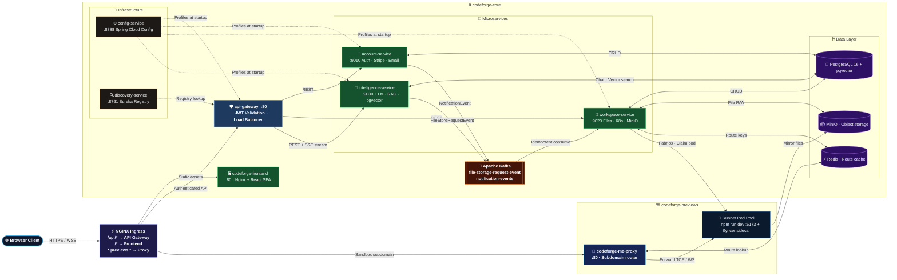

<div align="center">


<br/>

[](https://openjdk.org/projects/jdk/21/)
[](https://spring.io/projects/spring-boot)
[](https://react.dev/)
[](https://kubernetes.io/)
[](https://cloud.google.com/kubernetes-engine)
[](https://www.docker.com/)

<br/>

[](https://opensource.org/licenses/MIT)
[]()
[]()
[](https://github.com/aditighoshagd/Distributed-CodeForge/actions)

<br/>

> **A cloud-native, AI-powered collaborative IDE with instant Kubernetes sandbox previews.**
> Build, preview, and ship — all from your browser.

<br/>

[🎨 Architecture](#-system-architecture) &nbsp;•&nbsp; [📁 Repository Map](#-repository-map) &nbsp;•&nbsp; [⚡ Execution Flows](#-execution-flows) &nbsp;•&nbsp; [🚀 Quick Start](#-quick-start) &nbsp;•&nbsp; [🔄 CI/CD](#-cicd-pipeline) &nbsp;•&nbsp; [🖥️ Frontend](#️-frontend-repository)

</div>

---

## 📖 Overview

**Distributed CodeForge** is a cloud-native collaborative IDE and preview sandbox platform built on a modular microservices architecture with a state-of-the-art AI code generation and execution engine:

| Feature | Description |
|:---|:---|
| 💻 **Real-Time Collaborative Coding** | Multi-user project access with real-time directory updates and role-based permissions |
| 🧠 **Spring AI & LLM Engine** | Streaming LLM chat via OpenRouter with a strict XML prompt protocol for planning and execution |
| 🐘 **pgvector RAG Engine** | PostgreSQL `pgvector` semantic search injects project file trees and relevant code snippets dynamically |
| 👁️ **Multimodal Visual Diagnostics** | Visual bug diagnostics and design replication using screenshot attachments via `multipart/form-data` |
| 🩺 **Self-Healing Compile Loop** | Runner pods verify syntax, search past build-error solutions in `pgvector`, and record resolution diffs |
| 🏗️ **Instant K8s Sandbox Previews** | Isolated runner pods with pre-warmed standby pools, MinIO file syncing, and subdomain proxy routing |
| 💳 **Integrated Billing** | Stripe checkout, subscription plans, and token usage enforcement |

---

## 🖥️ Frontend Repository

> The React frontend for Distributed CodeForge lives in a separate repository.

<div align="center">

[](https://github.com/aditighoshagd/Distributed-Codeforge-Frontend)

</div>

The frontend is a **React 19** Single Page Application featuring:
- ⚡ **Real-time collaborative code editor** (Monaco Editor)
- 🌊 **SSE streaming** for live AI responses in the chat panel
- 🖼️ **Multimodal chat** with image/screenshot drag-and-drop support
- 🔴 **Live preview iframe** connected to subdomain-routed Kubernetes sandbox pods
- 💳 **Stripe checkout integration** for subscription management

> Served by an Nginx container deployed in the `codeforge-core` namespace and routed via the NGINX ingress.

---

## 🎨 System Architecture

Distributed CodeForge is split into **two Kubernetes namespaces** that are network-isolated from each other:
- `codeforge-core` — the stateless control plane housing all microservices, databases, and the message bus
- `codeforge-previews` — the dynamic sandbox execution plane for isolated runner pods



---

## 📁 Repository Map

```
Distributed-CodeForge/
│
├── 🔧 common-lib/                    # Shared DTOs, events, security filters
│   └── src/.../common_lib/
│       ├── dto/                      # UserDto, FileNode, PlanDto, FileTreeDto
│       ├── enums/                    # Shared enum types
│       ├── error/                    # GlobalExceptionHandler
│       ├── event/                    # Kafka event POJOs
│       └── security/                 # JwtAuthFilter, JwtUtils
│
├── ⚙️  config-service/               # Spring Cloud Config Server (port 8888)
├── 🔍 discovery-service/             # Eureka Service Registry (port 8761)
├── 🛡️  api-gateway/                  # Spring Cloud Gateway — JWT validation, routing
├── 👤 account-service/               # Auth, user management, Stripe billing, email (port 9010)
├── 📁 workspace-service/             # File system, K8s pod management, MinIO (port 9020)
├── 🧠 intelligence-service/          # LLM streaming, RAG pipeline, pgvector (port 9030)
│
├── ☸️  k8s/
│   ├── infra/
│   │   ├── namespaces.yaml           # codeforge-core + codeforge-previews
│   │   ├── runner-pool.yaml          # Pre-warmed sandbox pod pool
│   │   ├── network-policy.yaml       # Egress rules — block private RFC ranges
│   │   └── ingress.yaml              # NGINX ingress with subdomain routing
│   ├── stateful/
│   │   ├── pgvector.yaml             # PostgreSQL 16 + pgvector extension
│   │   ├── redis.yaml                # Redis for route cache & TTL metrics
│   │   ├── minio.yaml                # MinIO object storage for project files
│   │   └── kafka.yaml                # Apache Kafka event bus (2 brokers)
│   ├── services/                     # Deployment YAMLs for all microservices
│   └── proxy/
│       └── proxy-deployment.yaml     # codeforge-me-proxy subdomain router
│
├── 🔄 .github/workflows/
│   ├── deploy-account-service.yaml
│   ├── deploy-api-gateway.yaml
│   ├── deploy-config-service.yaml
│   ├── deploy-intelligence-service.yaml
│   └── deploy-workspace-service.yaml
│
├── start-cluster.sh                  # Scale all deployments up to 1 replica
└── stop-cluster.sh                   # Scale all deployments down to 0 replicas
```

---

## ⚡ Execution Flows

<details>
<summary><b>🤖 AI Code Generation Flow</b></summary>

```
User types prompt in ChatPanel
        │
        ▼
POST /api/intelligence/chat  (multipart/form-data with optional screenshot)
        │
        ▼
intelligence-service
  ├── 1. Fetch file tree from workspace-service (Feign client)
  ├── 2. pgvector semantic search → inject relevant code snippets
  ├── 3. Compose XML system prompt with planning + execution protocol
  └── 4. Stream LLM response via SSE (OpenRouter → OpenAI driver)
        │
        ▼
Frontend parses SSE chunks
  ├── <MESSAGE>   → append to chat bubble
  ├── <PLAN>      → render step-by-step plan panel
  └── <FILE_EDIT> → trigger file write + diff view
        │
        ▼
FILE_EDIT detected →
  ├── POST /api/workspace/files/write
  ├── MinIO file updated
  ├── Kafka FileStoreRequestEvent published
  └── Runner pod syncer sidecar pulls new file → live reload
```

</details>

<details>
<summary><b>🏗️ Sandbox Workspace Claim Flow</b></summary>

```
User clicks "Open Preview" in the IDE
        │
        ▼
POST /api/workspace/sandbox/claim
        │
        ▼
workspace-service (Fabric8 Kubernetes client)
  ├── 1. List idle pods in runner-pool (label: status=idle)
  ├── 2. Patch pod label → status=claimed, owner=<userId>
  ├── 3. Set subdomain annotation → <userId>.previews.codeforge.local
  ├── 4. Write Redis route key → <subdomain>:<podIP>:5173
  └── 5. MinIO syncer sidecar wakes up → pulls project files into pod volume
        │
        ▼
Frontend navigates iframe to subdomain URL
        │
        ▼
NGINX → codeforge-me-proxy
  ├── Extract subdomain from Host header
  ├── Redis lookup → podIP:5173
  └── TCP proxy forward → Runner Pod (Vite dev server)
```

</details>

<details>
<summary><b>💳 Stripe Billing Flow</b></summary>

```
User clicks "Upgrade Plan"
        │
        ▼
POST /api/account/billing/checkout
  └── Stripe Checkout Session created → redirect to Stripe

User completes payment on Stripe
        │
        ▼
Stripe webhook → POST /api/account/billing/webhook
  ├── Verify Stripe signature header
  ├── Idempotency check → event already processed? skip
  ├── Update subscription record (plan, status, token quota)
  └── Kafka NotificationEvent → account-service sends confirmation email
```

</details>

---

## 🚀 Quick Start

### Option A: Local (Kind + Docker)

<details>
<summary><b>Expand local setup steps</b></summary>

#### Step 1 — Prerequisites
```bash
brew install kind kubectl helm docker
```

#### Step 2 — Create Kind Cluster
```bash
kind create cluster --name codeforge --config kind-config.yaml
```

#### Step 3 — Build Common Library
```bash
cd common-lib && ./mvnw clean install -DskipTests && cd ..
```

#### Step 4 — Build & Load Images
```bash
for svc in account-service api-gateway workspace-service intelligence-service config-service; do
  cd $svc && ./mvnw compile jib:dockerBuild && cd ..
done
kind load docker-image aditiighosh/codeforge-account-service:latest --name codeforge
# repeat for each service
```

#### Step 5 — Create Secrets
```bash
kubectl apply -f k8s/infra/namespaces.yaml
kubectl create secret generic app-secrets \
  --from-literal=JWT_SECRET=your_jwt_secret \
  --from-literal=STRIPE_API_KEY=sk_live_... \
  --from-literal=AI_API_KEY=sk-or-v1-... \
  -n codeforge-core
```

#### Step 6 — Deploy Everything
```bash
kubectl apply -f k8s/stateful/         # Databases, Kafka, Redis, MinIO
kubectl apply -f k8s/services/         # All microservices
kubectl apply -f k8s/proxy/            # Subdomain proxy
kubectl apply -f k8s/infra/            # Runner pool, network policies, ingress
kubectl get pods -n codeforge-core -w  # Watch startup
```

#### Step 7 — Scale Sandbox Pool
```bash
kubectl scale deployment runner-pool --replicas=3 -n codeforge-previews
```

</details>

---

### Option B: GKE (Production)

<details>
<summary><b>Expand GKE setup steps</b></summary>

#### Step 1 — Authenticate & Configure
```bash
gcloud auth login
gcloud config set project YOUR_PROJECT_ID
gcloud container clusters get-credentials YOUR_CLUSTER --region YOUR_REGION
```

#### Step 2 — Build & Push Images via Jib
```bash
cd common-lib && ./mvnw clean install -DskipTests && cd ..

for svc in account-service api-gateway workspace-service intelligence-service config-service; do
  cd $svc
  ./mvnw compile jib:build \
    -Djib.to.image=docker.io/aditiighosh/codeforge-${svc}:latest \
    -Djib.to.auth.username=$DOCKERHUB_USERNAME \
    -Djib.to.auth.password=$DOCKERHUB_TOKEN
  cd ..
done
```

#### Step 3 — Create Secrets & Apply Manifests
```bash
kubectl create secret generic app-secrets \
  --from-literal=JWT_SECRET=your_jwt_secret \
  --from-literal=STRIPE_API_KEY=sk_live_... \
  --from-literal=AI_API_KEY=sk-or-v1-... \
  -n codeforge-core

kubectl apply -f k8s/infra/namespaces.yaml
kubectl apply -f k8s/stateful/
kubectl apply -f k8s/services/
kubectl apply -f k8s/proxy/
kubectl apply -f k8s/infra/
```

#### Step 4 — Wake Up Services
```bash
./start-cluster.sh
```

</details>

---

## 🔧 Useful Commands

```bash
# ── Monitoring ──────────────────────────────────────────────────────────────
kubectl get pods -A                                              # All pods
kubectl get pods -n codeforge-core -w                           # Watch core pods
kubectl top pods -n codeforge-core                              # CPU/Memory usage

# ── Logs ─────────────────────────────────────────────────────────────────────
kubectl logs deployment/workspace-service -n codeforge-core -f
kubectl logs deployment/intelligence-service -n codeforge-core -f
kubectl logs deployment/api-gateway -n codeforge-core -f

# ── Scaling ───────────────────────────────────────────────────────────────────
./start-cluster.sh                                              # Scale all up
./stop-cluster.sh                                               # Scale all down
kubectl scale deployment runner-pool --replicas=5 -n codeforge-previews

# ── Database ──────────────────────────────────────────────────────────────────
kubectl exec pgvector-0 -n codeforge-core -- \
  psql -U postgres -d intelligence_db -c \
  "SELECT * FROM chat_messages ORDER BY id DESC LIMIT 5;"

# ── Debugging ─────────────────────────────────────────────────────────────────
kubectl rollout restart deployment intelligence-service -n codeforge-core
kubectl describe pod <pod-name> -n codeforge-core
kubectl exec -it <pod-name> -n codeforge-core -- /bin/sh
```

---

## 🔄 CI/CD Pipeline

Every microservice has a dedicated **GitHub Actions** workflow that triggers automatically on push to `main` — path-filtered so only the changed service rebuilds.

### Workflows

| Workflow | Trigger Path | Deploys To |
|:---|:---|:---|
| `deploy-account-service.yaml` | `account-service/**`, `common-lib/**` | `codeforge-core/account-service` |
| `deploy-api-gateway.yaml` | `api-gateway/**`, `common-lib/**` | `codeforge-core/api-gateway` |
| `deploy-config-service.yaml` | `config-service/**` | `codeforge-core/config-service` |
| `deploy-intelligence-service.yaml` | `intelligence-service/**`, `common-lib/**` | `codeforge-core/intelligence-service` |
| `deploy-workspace-service.yaml` | `workspace-service/**`, `common-lib/**` | `codeforge-core/workspace-service` |

### Pipeline Stages

```
git push → main
      │
      ▼
① Checkout code
      │
      ▼
② Set up JDK 21 (Temurin) + Maven cache
      │
      ▼
③ chmod +x ./mvnw → Build & install common-lib
      │
      ▼
④ Jib compile → push Docker image to DockerHub
      │   Tagged: docker.io/aditiighosh/<service>:<git-sha>
      │   Also tagged: latest
      │   No Docker daemon required (Jib builds in-process)
      │
      ▼
⑤ Authenticate to GCP via Workload Identity Federation (keyless)
      │
      ▼
⑥ Get GKE cluster credentials
      │
      ▼
⑦ kubectl set image → rolling update on GKE
      │
      ▼
⑧ kubectl rollout status → pipeline blocks until pods healthy ✅
```

### Required GitHub Secrets

| Secret | Description |
|:---|:---|
| `DOCKERHUB_USERNAME` | Docker Hub username for Jib image push |
| `DOCKERHUB_TOKEN` | Docker Hub access token |
| `GCP_WORKLOAD_IDENTITY_PROVIDER` | GCP Workload Identity Federation provider resource name |
| `GCP_SERVICE_ACCOUNT` | GCP service account email with GKE deploy permissions |
| `GCP_CLUSTER` | GKE cluster name |
| `GCP_ZONE` | GKE cluster zone/region |

> **🔐 Keyless Auth**: Uses [GCP Workload Identity Federation](https://cloud.google.com/iam/docs/workload-identity-federation) — GitHub Actions OIDC token is exchanged for short-lived GCP credentials. No service account key files stored anywhere.

---

## ⚙️ Recent Bug Fixes

| # | Fix | Impact |
|:---:|:---|:---|
| 1 | **Actuator Health Recovery** — disabled mail health probe | Prevented `account-service` crash loops when Brevo SMTP credentials expire |
| 2 | **Subscription NonUniqueResult** — returned list from subscription repo, sorted by highest ID | Fixed Hibernate exception when users had both `DEMO` and `ACTIVE` subscription rows |
| 3 | **Always-FormData Chats** — rebuilt stream client to always use `FormData` | Fixed `415 Unsupported Media Type` and enabled direct image file uploads |
| 4 | **Trailing-Slash 404** — removed trailing slash from `InternalWorkspaceController` `@RequestMapping` | Fixed Feign client routing to internal workspace endpoints |
| 5 | **XML Fallback Parser** — added `MESSAGE`/`FILE_EDIT` event fallback when no XML tags found | Fixed blank assistant reply bubbles when AI responded with plain Markdown |
| 6 | **ChatEventType Import** — added missing enum import in `ChatPanel.tsx` | Fixed `ChatEventType is not defined` ReferenceError that crashed the workspace |

---

## 🛡️ Security

- **Namespace Isolation** — microservices in `codeforge-core`, user sandboxes in `codeforge-previews` (no network crossing)
- **Network Policies** — sandbox pods block outbound to private RFC ranges (`10.0.0.0/8`, `172.16.0.0/12`, `192.168.0.0/16`)
- **JWT Guard Filters** — all requests validated at API Gateway via shared Spring Security `JwtAuthFilter`
- **Database Idempotency** — Stripe webhooks and Kafka Saga edits check event history before execution to prevent double-writes

---

## ⚡ Performance

- **Pre-warmed Pod Pool** — standby runner pods eliminate cold starts; idle pods are claimed in milliseconds
- **Redis Route Cache** — subdomain-to-pod routing stored in Redis for sub-millisecond lookups
- **LRU Sandbox Eviction** — when pool is full, oldest active pod is reclaimed and recycled to idle pool
- **Kafka Async Sagas** — file edits processed asynchronously, preventing AI streaming from blocking on file I/O

---

## ⚠️ Known Limitations

1. **Single-Instance Databases** — Postgres, Redis, Kafka, and MinIO run as single StatefulSets with no replication
2. **No Auto-scaling** — sandbox runner pool must be manually scaled via `kubectl scale` or `start-cluster.sh`
3. **Synchronous PGVector Indexing** — file chunk indexing happens synchronously on save; background batch reindexing not yet implemented

---

## 📜 License

This project is licensed under the **MIT License** — see the [LICENSE](LICENSE) file for details.

---

<div align="center">

Built with ☕ Java &nbsp;|&nbsp; ⚛️ React &nbsp;|&nbsp; ☸️ Kubernetes &nbsp;|&nbsp; 🤖 Spring AI

**Distributed CodeForge** — *Code. Preview. Ship.*

[](https://github.com/aditighoshagd/Distributed-Codeforge-Frontend)
[](https://github.com/aditighoshagd/Distributed-CodeForge)

</div>
